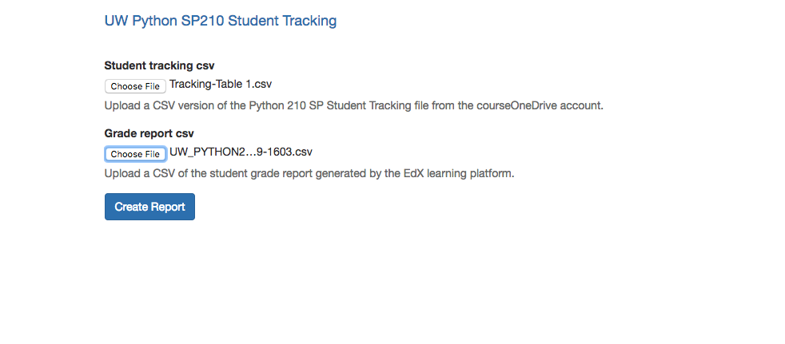
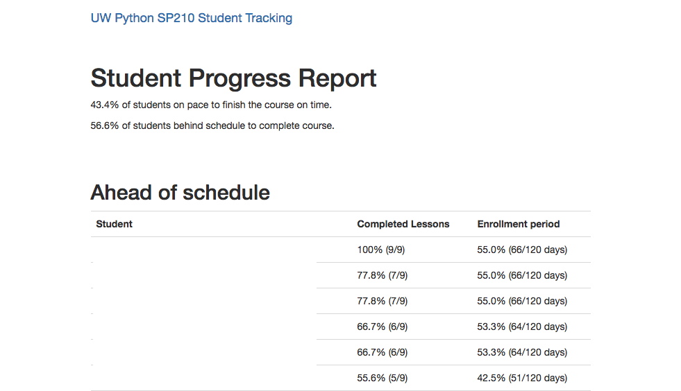
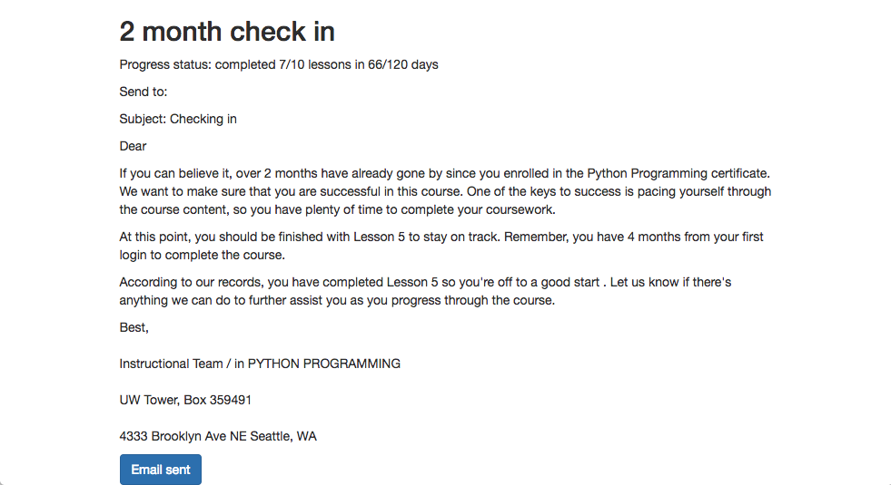

# UW Python 210SP Student Progress Tracking

A localhost Django app for tracking student progress and generating check in emails. The Student Tracking
spreadsheet should be downloaded from the course OneDrive account and converted to CSV format. The grade
report CSV can be generated and downloaded via the Data Download panel of the EdX learning platform.

## Usage

Make sure you are using a virtual environment of some sort (e.g. `virtualenv` or
`pyenv`).

Place an updated copy of the SQLite `dev.db` file in the project root directory.

Copy the example settings file and add the course links and email credentials:
```
cp student_tracking/settings.py.example student_tracking/settings.py
```
Install requirements, load data and run the dev server:
```
pip install -r requirements.txt
./manage.py migrate
./manage.py loaddata sites
./manage.py runserver
```

Browse to http://localhost:8000/

Create superuser account to access student data in the [Django admin](http://localhost:8000/admin):

```
./manage.py createsuperuser
```
Upload the Student Tracking and Grade Report CSV files. 



Generate student progress reports and check in emails.






